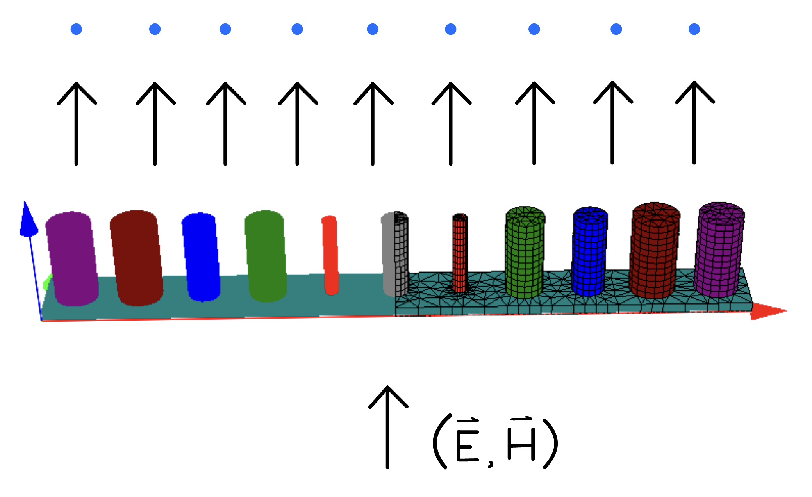

# Deep Learning for Nano-Scattering

## Overview
This project leverages **deep learning** techniques to design nano-scattering instruments, specifically focusing on a **metasurface dot-projector**. The dot-projector consists of silicon rods on a silica substrate, scattering light into targeted patterns. Our goal is to use deep learning models to solve the **inverse design problem** by predicting rod radii for desired scattering flux.


## Key Features
- **Finite Element Method (FEM)** simulations for electromagnetic scattering.
- **Tandem model** with forward and backward neural networks.
- Use of **Conditional GANs (CGANs)** to generate diverse geometries.
- **Bayesian optimization** to enhance FEM efficiency.

## Methods
1. **Forward Model**: Predicts flux based on rod geometry using neural networks.
2. **Backward Model**: Inverse design predicting geometry from target flux.
3. **CGANs**: Generates multiple geometries for given flux values.
4. **Optimization**: Gradient descent used to refine geometries for practical stability.

## Data Generation
- **35,000 samples** for training, **6,000 samples** for testing.
- **JCMwave software** used for FEM simulations.
- **Sobol sequences** employed for sampling.

| Rod Radius (nm) | Min | Max |
|----------------|-----|-----|
| Radius 1–3     | 180 | 240 |
| Radius 4       | 140 | 200 |
| Radius 5       | 200 | 260 |
| Radius 6       | 180 | 240 |

## Results
- **Tandem model**: Achieves high accuracy with MSE < 0.01.
- **CGANs**: Generates diverse solutions but requires further refinement for practical use.
- **Optimization**: Identified stable geometries with minimal MAE.

## Usage
1. Clone the repository:
   ```bash
   git clone https://github.com/tbw121/Deep-learning-for-nano-scattering.git
   cd Deep-learning-for-nano-scattering
   ```
2.	Install dependencies:
  ```bash
  pip install -r requirements.txt
  ```

3.	Run simulations and models:
  ```bash
  python run_model.p
  ```
## Dependencies
- Python 3.x  
- JCMsuite  
- NumPy, TensorFlow/PyTorch  
- SciPy, Matplot
